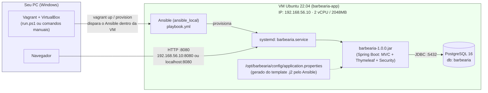

# Infraestrutura — Projeto Barbearia (Estágio 1: VM)

Virtualização completa do backend Spring Boot (Java 21 + PostgreSQL 16) do
Projeto Integrador em **1 VM Vagrant/VirtualBox**, provisionada do zero de
forma automática e idempotente com **Ansible**.

## Pré-requisitos

Instale no seu Windows antes de começar:

| Ferramenta | Versão mínima | Link |
| --- | --- | --- |
| VirtualBox | 7.0+ | https://www.virtualbox.org/wiki/Downloads |
| Vagrant | 2.4+ | https://developer.hashicorp.com/vagrant/downloads |
| Virtualização habilitada na BIOS (VT-x/AMD-V) | — | verifique no Gerenciador de Tarefas → Desempenho → CPU → "Virtualização: Habilitada" |

Não é necessário instalar Java, Maven, PostgreSQL **nem Ansible** no seu
Windows — tudo é instalado **dentro da VM** (o Ansible roda em modo
`ansible_local`: ele mesmo se instala dentro do convidado e provisiona a
própria VM, sem precisar de nada além de VirtualBox + Vagrant no host).

## Passo a passo (cmd/PowerShell, na ordem)

Forma rápida — um comando só. Tem dois scripts, dependendo do que você quer:

```powershell
cd "app.java\infra"

# Liga o que já existe (rápido). Se a VM ainda não existe, cria do zero.
# Use no dia a dia / na apresentação.
.\start.ps1

# Apaga a VM existente e recria tudo do absoluto zero (mais lento).
# Use quando quiser garantir um ambiente 100% limpo.
.\run.ps1
```

Os dois checam se Vagrant/VirtualBox estão instalados e mostram as URLs no
final. A diferença é só se a VM existente é preservada (`start.ps1`) ou
destruída antes (`run.ps1`, que faz `vagrant destroy -f` + `vagrant up`).

Forma manual, comando a comando:

```bat
:: 1. Entre na pasta de infraestrutura (dentro do repositório do projeto)
cd "app.java\infra"

:: 2. Suba a VM do zero — baixa a box, cria a VM, instala o Ansible dentro
::    dela, e o Ansible instala Java 21, Maven, PostgreSQL 16, cria
::    banco/usuário, builda o projeto com Maven e inicia a aplicação como
::    serviço systemd. Leva alguns minutos na primeira vez (download da box
::    + downloads do Maven/apt).
vagrant up

:: 3. (opcional) Rodar o Ansible de novo sem recriar a VM
vagrant provision

:: 4. Acessar a aplicação no navegador
::    http://192.168.56.10:8080
::    (alternativa: http://localhost:8080, via port-forward)

:: 5. (opcional) Entrar na VM por SSH, sem senha
vagrant ssh

:: 6. Desligar a VM (mantém o disco, religa rápido depois)
vagrant halt

:: 7. Religar depois de um halt
vagrant up

:: 8. Destruir a VM por completo (recomeça do zero no próximo "vagrant up")
vagrant destroy -f
```

Ao final do `vagrant up` (ou do `run.ps1`), a aplicação já está no ar —
**nenhum passo manual adicional é necessário**. O próprio playbook espera a
aplicação responder em `http://localhost:8080` antes de terminar o
provisionamento.

> **Por que HTTP e não HTTPS:** o app roda em HTTP puro, como pede o
> enunciado (`http://<IP-da-VM>:8080`). Chegamos a testar HTTPS com
> certificado autoassinado, mas ele gera o aviso "Não
> seguro"/`NET::ERR_CERT_AUTHORITY_INVALID` em **qualquer** navegador/PC que
> acessar a VM (inclusive o de quem for avaliar o trabalho), porque não é
> emitido por uma autoridade pública — não compensa a complexidade extra para
> uma VM de estudo. Ficamos só com HTTP.

## Diagrama da infraestrutura



**Portas expostas:**

| Porta | Onde | Protocolo/Uso |
| --- | --- | --- |
| 8080 | VM (192.168.56.10) e forwarded para localhost do host | HTTP — aplicação Spring Boot |
| 5432 | Somente dentro da rede privada 192.168.56.0/24 | PostgreSQL — não exposto para fora da rede da VM |
| 22 | Gerenciado pelo próprio Vagrant | SSH — `vagrant ssh` (chave automática) |

## Estrutura de pastas

```text
infra/
├── Vagrantfile                       # define a VM, rede, recursos e dispara o Ansible (ansible_local)
├── config.yml                        # TODAS as variáveis configuráveis (IP, CPU, RAM, porta, DB)
├── inventory.yml                     # inventário documental: VM, papel (app-server), IP, portas, serviços
├── start.ps1                         # liga o que já existe (ou cria, se não existir) — rápido
├── run.ps1                           # apaga e recria tudo do zero (destroy + up) — mais lento
├── ansible/
│   ├── ansible.cfg                   # configuração do Ansible (roda dentro da VM)
│   ├── inventory.ini                 # inventário FUNCIONAL: só "localhost" (ansible_connection=local)
│   ├── playbook.yml                  # playbook principal — orquestra as roles abaixo
│   ├── group_vars/
│   │   └── all.yml                   # valores default das variáveis (sobrescritos por config.yml)
│   └── roles/
│       ├── base_packages/            # pacotes base + descoberta do codinome do Ubuntu
│       ├── java/                     # Temurin 21 JDK (repositório Adoptium)
│       ├── maven/                    # Maven
│       ├── postgresql/               # PostgreSQL 16 (repositório PGDG), rede, banco e usuário
│       ├── app_setup/                # usuário de sistema e diretórios da aplicação
│       ├── build_app/                # rsync do código-fonte + mvn clean package
│       ├── configure_app/            # gera application.properties e o serviço systemd
│       │   └── templates/            # application.properties.j2, barbearia.service.j2
│       ├── ssh_external_key/         # autoriza a chave SSH pública do host (opcional)
│       └── wait_for_app/             # espera a aplicação responder antes de terminar
├── .gitignore                        # ignora o estado local do Vagrant (.vagrant/)
└── .gitattributes                    # força LF nos arquivos que rodam dentro da VM
```

### O que cada arquivo faz

- **Vagrantfile** — lê `config.yml`, cria a VM `ubuntu/jammy64`, define o IP
  fixo na rede privada, o port-forward 8080→8080, o synced folder que espelha
  o projeto (`..`, a pasta `app.java/`) para `/vagrant/app` dentro da VM, e
  dispara o Ansible (`ansible_local`) passando as variáveis como `extra_vars`.
- **config.yml** — único lugar com IP, memória, CPU, porta da app e
  credenciais do banco. Mudar algo aqui e rodar `vagrant provision` já
  reconfigura a VM.
- **inventory.yml** — documenta a topologia (1 VM, papel `app-server` rodando
  backend + banco, IP, portas, serviços). É só documental — o inventário que
  o Ansible de fato usa é `ansible/inventory.ini`.
- **start.ps1** — script de conveniência para Windows: liga a VM existente
  (rápido) ou cria do zero se ela ainda não existir. Não apaga nada.
- **run.ps1** — script de conveniência para Windows: derruba qualquer VM
  existente e sobe tudo de novo do zero com um comando só.
- **ansible/playbook.yml** — o "script principal" (equivalente Ansible do
  antigo `provision.sh`): orquestra as roles que instalam Java 21 (Temurin),
  Maven, PostgreSQL 16 (via repositório oficial PGDG), criam o banco e o
  usuário do banco, buildam o projeto com `mvn clean package`, geram o
  `application.properties` a partir do template, instalam o serviço systemd
  e iniciam a aplicação. **Idempotente**: cada role usa módulos Ansible que
  já checam o estado atual antes de agir (pacote já instalado, usuário já
  existe, arquivo já configurado etc.).
- **ansible/group_vars/all.yml** — valores default das variáveis, usados só
  se o playbook rodar sem passar pelo Vagrant/`config.yml`.
- **ansible/roles/configure_app/templates/*.j2** — os templates Jinja2 reais
  do `application.properties` e do `barbearia.service`, preenchidos pelo
  módulo `template` do Ansible a partir das variáveis de `config.yml`.

## Como o Ansible é usado

O provisionamento roda com o provisioner **`ansible_local`** do Vagrant: o
Ansible é instalado e executado **dentro da própria VM**, provisionando a si
mesma — por isso o inventário funcional (`ansible/inventory.ini`) só tem um
host, `localhost`, com `ansible_connection=local` (sem SSH). Isso evita
qualquer dependência de Ansible no Windows (que não roda nativamente como
*controller* — normalmente exigiria WSL).

O Vagrantfile continua sendo quem lê `config.yml` e repassa os valores para
o playbook via `extra_vars` — `config.yml` permanece a única fonte de
verdade para IP, memória, porta e credenciais.

**Rodar o playbook manualmente**, sem passar pelo ciclo completo do Vagrant
(útil para iterar rápido em uma role sem esperar todo o `vagrant provision`):

```bash
vagrant ssh
cd /vagrant
ansible-playbook ansible/playbook.yml -i ansible/inventory.ini
```

Como as variáveis default em `ansible/group_vars/all.yml` já refletem os
valores atuais de `config.yml`, isso funciona mesmo sem os `extra_vars` do
Vagrant — só não vai refletir uma mudança feita em `config.yml` que ainda não
tenha sido copiada para `group_vars/all.yml` manualmente.

Se o Estágio 2 do trabalho pedir múltiplas VMs (ex: separar app-server e
db-server), a evolução natural é trocar `ansible_local` por `ansible`
(controller rodando do host via SSH) e usar `inventory.yml` como base para um
inventário real com vários hosts — as roles já ficam praticamente prontas
para isso, já que não dependem de nada específico de rodar localmente.

## Solução de problemas

- **`VT-x is disabled in the BIOS`** — habilite a virtualização na BIOS/UEFI
  do seu PC (Intel VT-x ou AMD-V), reinicie e rode `vagrant up` (ou
  `.\run.ps1`) de novo.
- **`Operation not permitted` ao rodar `mvn clean`** — limitação conhecida da
  pasta compartilhada do VirtualBox (vboxsf), que não segue a semântica normal
  de permissões Unix. Por isso a role `build_app` copia o código de
  `/vagrant/app` para `/opt/barbearia-build` (filesystem nativo da VM) antes
  de buildar — o synced folder só serve para trazer o código-fonte para
  dentro da VM, o build nunca roda diretamente nele.
- **Synced folder falha ao montar (`vboxsf`)** — instale o plugin
  `vagrant plugin install vagrant-vbguest` e rode `vagrant reload`.
- **Porta 8080 já em uso no Windows** — o `forwarded_port` usa
  `auto_correct: true`, então o Vagrant escolhe outra porta automaticamente e
  avisa qual foi escolhida; o acesso por `http://192.168.56.10:8080`
  continua funcionando normalmente de qualquer forma.
- **Quiser mudar IP/memória/porta/credenciais** — edite só `config.yml` e
  rode `vagrant reload --provision` (recria a rede/recursos e reprovisiona).
- **Quiser ver a saída completa do Ansible** — o `ansible_local` já imprime
  o resultado de cada task no log do `vagrant up`/`vagrant provision`; para
  mais detalhe, rode manualmente dentro da VM com `-v` (ou `-vvv`):
  `vagrant ssh -c "cd /vagrant && ansible-playbook ansible/playbook.yml -i ansible/inventory.ini -vvv"`.
- **`cannot load such file -- vagrant (LoadError)`** — erro intermitente do
  próprio Vagrant no Windows (não tem relação com este projeto). Costuma
  acontecer em comandos "pesados" (`vagrant up`/`destroy`/`provision`) e não
  em comandos leves (`vagrant --version`/`global-status`), o que sugere uma
  disputa passageira por arquivo — provavelmente o OneDrive sincronizando ou
  o antivírus escaneando bem no momento em que o Vagrant tenta ler seus
  próprios arquivos internos (isso é agravado por o projeto morar dentro de
  uma pasta do OneDrive). **Solução: rode o mesmo comando de novo** — na
  prática ele passa a funcionar já na segunda ou terceira tentativa. Se
  persistir, pause a sincronização do OneDrive (ícone dele na bandeja do
  Windows → Pausar sincronização → 24 horas) e tente de novo.
