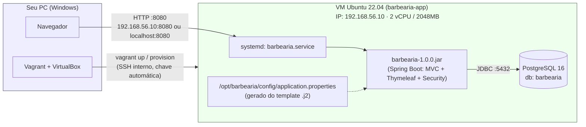

# Infraestrutura — Projeto Barbearia (Estágio 1: VM)

Virtualização completa do backend Spring Boot (Java 21 + PostgreSQL 16) do
Projeto Integrador em **1 VM Vagrant/VirtualBox**, provisionada do zero de
forma automática e idempotente.

## Pré-requisitos

Instale no seu Windows antes de começar:

| Ferramenta | Versão mínima | Link |
| --- | --- | --- |
| VirtualBox | 7.0+ | https://www.virtualbox.org/wiki/Downloads |
| Vagrant | 2.4+ | https://developer.hashicorp.com/vagrant/downloads |
| Virtualização habilitada na BIOS (VT-x/AMD-V) | — | verifique no Gerenciador de Tarefas → Desempenho → CPU → "Virtualização: Habilitada" |

Não é necessário instalar Java, Maven ou PostgreSQL no seu Windows — tudo é
instalado **dentro da VM** pelo script de provisionamento.

## Passo a passo (cmd/PowerShell, na ordem)

```bat
:: 1. Entre na pasta de infraestrutura (dentro do repositório do projeto)
cd "app.java\infra"

:: 2. Suba a VM do zero — baixa a box, cria a VM, instala Java 21, Maven,
::    PostgreSQL 16, cria banco/usuário, builda o projeto com Maven e
::    inicia a aplicação como serviço systemd. Leva alguns minutos na
::    primeira vez (download da box + downloads do Maven).
vagrant up

:: 3. (opcional) Acompanhar o provisionamento novamente sem recriar a VM
vagrant provision

:: 4. Acessar a aplicação no navegador
::    http://192.168.56.10:8080
::    (alternativa: http://localhost:8080, via port-forward)

:: 5. (opcional) Entrar na VM por SSH, sem senha
vagrant ssh

:: 6. Desligar a VM (mantém o disco, religa rápido depois)
vagrant halt

:: 7. Religar depois de um halt
vagrant up

:: 8. Destruir a VM por completo (recomeça do zero no próximo "vagrant up")
vagrant destroy -f
```

Ao final do `vagrant up`, a aplicação já está no ar — **nenhum passo manual
adicional é necessário**. O próprio script espera a aplicação responder em
`http://localhost:8080` antes de terminar o provisionamento.

## Diagrama da infraestrutura



**Portas expostas:**

| Porta | Onde | Protocolo/Uso |
| --- | --- | --- |
| 8080 | VM (192.168.56.10) e forwarded para localhost do host | HTTP — aplicação Spring Boot |
| 5432 | Somente dentro da rede privada 192.168.56.0/24 | PostgreSQL — não exposto para fora da rede da VM |
| 22 | Gerenciado pelo próprio Vagrant | SSH — `vagrant ssh` (chave automática) |

## Estrutura de pastas

```text
infra/
├── Vagrantfile                       # define a VM, rede, recursos e chama o provisionamento
├── config.yml                        # TODAS as variáveis configuráveis (IP, CPU, RAM, porta, DB)
├── inventory.yml                     # inventário: VM, papel (app-server), IP, portas, serviços
├── scripts/
│   └── provision.sh                  # instala tudo, builda o projeto e sobe a aplicação (idempotente)
├── templates/
│   ├── application.properties.j2     # template preenchido com as variáveis de config.yml
│   └── barbearia.service.j2          # template do serviço systemd da aplicação
├── .gitignore                        # ignora o estado local do Vagrant (.vagrant/)
└── .gitattributes                    # força LF nos scripts (evita erro de CRLF vindo do Windows)
```

### O que cada arquivo faz

- **Vagrantfile** — lê `config.yml`, cria a VM `ubuntu/jammy64`, define o IP
  fixo na rede privada, o port-forward 8080→8080, o synced folder que espelha
  o projeto (`..`, a pasta `app.java/`) para `/vagrant/app` dentro da VM, e
  dispara `scripts/provision.sh` passando as variáveis como ambiente.
- **config.yml** — único lugar com IP, memória, CPU, porta da app e
  credenciais do banco. Mudar algo aqui e rodar `vagrant provision` já
  reconfigura a VM.
- **inventory.yml** — documenta a topologia (1 VM, papel `app-server` rodando
  backend + banco, IP, portas, serviços). Não é consumido por nenhuma
  ferramenta automaticamente (ver seção abaixo sobre Ansible), mas já segue o
  formato de inventário Ansible caso o projeto evolua para isso depois.
- **scripts/provision.sh** — o script principal. Instala Java 21 (Temurin),
  Maven, PostgreSQL 16 (via repositório oficial PGDG), cria o banco e o
  usuário do banco, builda o projeto com `mvn clean package`, gera o
  `application.properties` a partir do template, instala o serviço systemd e
  inicia a aplicação. **Idempotente**: cada etapa verifica se o recurso já
  existe antes de criar (pacote já instalado, role/banco já existe, usuário
  de sistema já existe, repositório apt já configurado etc.).
- **templates/application.properties.j2** — o `application.properties` real
  da aplicação, com `${DB_NAME}`, `${DB_USER}`, `${DB_PASSWORD}`, `${DB_PORT}`
  e `${APP_PORT}` como placeholders, preenchidos via `envsubst` a partir das
  variáveis de `config.yml`.
- **templates/barbearia.service.j2** — unit do systemd que roda o `.jar`,
  também parametrizada (usuário do sistema, diretório de instalação, nome do
  jar).

## Por que shell provisioner e não Ansible?

Optei pelo **shell provisioner nativo do Vagrant** em vez de Ansible por três
motivos práticos para este cenário:

1. **Um único host.** Ansible ganha valor quando você orquestra várias
   máquinas em paralelo com playbooks reutilizáveis; aqui há só 1 VM
   (`app-server`), então a camada extra de inventário/playbooks do Ansible
   não compensa a complexidade adicional.
2. **Menos dependências no Windows.** Ansible não roda nativamente no
   Windows como *controller* — normalmente exigiria WSL só para provisionar
   uma única VM local. O shell provisioner do Vagrant funciona direto,
   sem nada além de VirtualBox + Vagrant.
3. **Idempotência é totalmente alcançável em shell puro** (checks de
   `dpkg -s`, `pg_roles`, `pg_database`, `id -u` antes de cada ação), então
   não perdemos a garantia de "rodar de novo não quebra nada" só por não usar
   Ansible.

Se o Estágio 2 do trabalho pedir múltiplas VMs (ex: separar app-server e
db-server) ou orquestração mais sofisticada, `inventory.yml` já está no
formato certo para virar um inventário Ansible de verdade nesse momento.

## Solução de problemas

- **`VT-x is disabled in the BIOS`** — habilite a virtualização na BIOS/UEFI
  do seu PC.
- **Synced folder falha ao montar (`vboxsf`)** — instale o plugin
  `vagrant plugin install vagrant-vbguest` e rode `vagrant reload`.
- **Porta 8080 já em uso no Windows** — o `forwarded_port` usa
  `auto_correct: true`, então o Vagrant escolhe outra porta automaticamente e
  avisa qual foi escolhida; o acesso por `http://192.168.56.10:8080`
  continua funcionando normalmente de qualquer forma.
- **Quiser mudar IP/memória/porta/credenciais** — edite só `config.yml` e
  rode `vagrant reload --provision` (recria a rede/recursos e reprovisiona).
